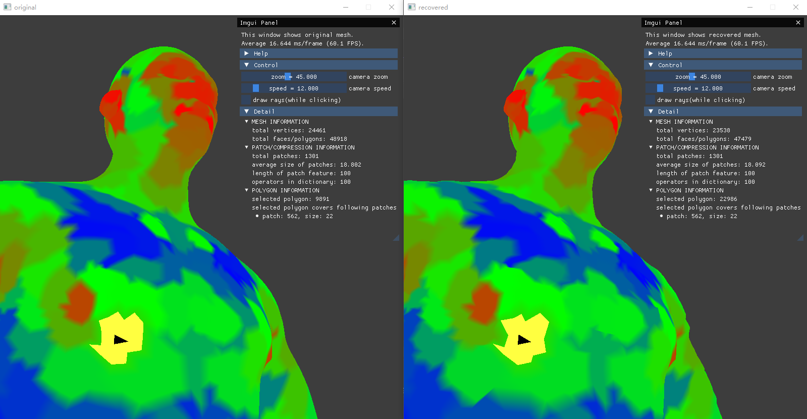

# 2022某厂暑期实习项目——基于patch的3D网格压缩

## 概况

本课题属于预研性质课题，目标是设计一套基于patch的高效3D网格压缩方案。本方案主要探究和挖掘3D网格本身的空间特征，将复杂的特征表示为较为简单的特征描述子的组合，从而达到压缩网格数据的效果。

- 为什么要压缩3D网格？
  
  对于游戏而言，游戏的包体大小非常重要，尤其是在存储空间紧缺的移动端。减小包体尺寸既可以节约存储空间，也可以节约下载耗费的时间和流量。游戏素材里的3D网格数据是影响包体尺寸的一个重要因素，如何高效地压缩3D网格是一个值得研究的问题。

- 什么是patch？什么是patch特征？
  
  patch是一些具有某种相似性的面或顶点的集合，可以看成原始网格的一个子集。本方案将原始网格通过某种方式划分为多个patch，并设计一种特征生成方法，把原始网格数据转化为patch特征数据，然后针对patch特征进行压缩和解压。这样做的好处是可以利用patch间的相似性进行数据压缩。

- 什么是特征描述子？
  
  特征描述子可以看作是表示patch特征空间的一组“基底”。在生成了patch特征之后，由于patch特征维数很高，为了压缩这些特征，可以提取出一组数量较少的“基底”，将原始特征表示为基底的线性组合，从而把高维的patch特征数据压缩为一组较低维的线性组合系数。当然这样的压缩是有损的。

编译环境：VS2022。

配置文件：根目录下的config.json。里面包含了压缩算法参数。

答辩PPT见docs文件夹。

## 具体实现

算法代码请见`source\algorithm\compressor.cpp`。方法参考[《Self-similarity for accurate compression of point sampled surfaces》](https://hal.archives-ouvertes.fr/docs/00/98/30/03/PDF/eurographics2014_final.pdf)。

1. 划分patch。从网格上曲率较高的区域开始，选取种子点(seed)并以其为中心向外扩散从而生成patch，为了保证patch区域平坦，限制patch内的点与种子点的法线夹角不超过90度。

2. 生成patch特征。对于每个patch，为其构建局部坐标系，坐标系的原点为种子点位置，z轴为种子点法线。在局部坐标系的xy平面划分网格，利用这个网格对patch内的点做重采样，采样结果为每个grid对应的patch顶点的高度(局部z坐标)。所有网格的采样结果组成patch特征。

3. 编码。使用SVD分解，将patch特征矩阵分解为字典矩阵(特征描述子矩阵)和编码矩阵(线性组合系数矩阵)。

4. 记录连接性。原本的面数据由每个顶点的下标表示，在划分patch和grid后，将面的数据表示为每个顶点所在的patch号和grid号。

5. 序列化。把patch信息、字典矩阵和编码矩阵、连接性信息等保存为一个文件，该文件就是压缩后的3D网格。

6. 解压缩。读取序列化生成的文件，通过上述方法对应的逆方法还原出patch和整个网格。

## 代码结构

整个工程主要分为核心定义、通用工具、压缩算法、可视化四个部分，分别对应`source\core`、`source\tools`、`source\algorithm`、`source\display`四个文件夹。

- 核心定义`source\core`
  
  - `Data(data.h)`：记录所有网格相关数据，用于压缩、解压缩和可视化。
  
  - `Config(data.h)`：记录压缩算法参数，从根目录的config.json文件读取。

- 通用工具`source\tools`
  
  - `ObjLoader(load_obj_mesh.h)`：OBJ格式网格的加载工具，用于读取原始网格。

- 压缩算法`source\algorithm`
  
  - `Compressor(compressor.h)`：压缩算法实现类。
  
  - `Parser(parser.h)`：解压缩算法实现类。

- 可视化`source\display`
  
  - `PolygonPicker(polygon_picker.h)`：面片和patch拾取器，实现点选面片和patch的功能，用于调试和结果展示。
  
  - `OpenGLWindow(opengl_window.h)`：抽象了基于OpenGL和Dear ImGui的可视化操作，同时保证线程安全性。

## 其他仓库引用

- [tinyobjloader](https://github.com/tinyobjloader/tinyobjloader)

- [Dear ImGui](https://github.com/ocornut/imgui)

- [json](https://github.com/nlohmann/json)
